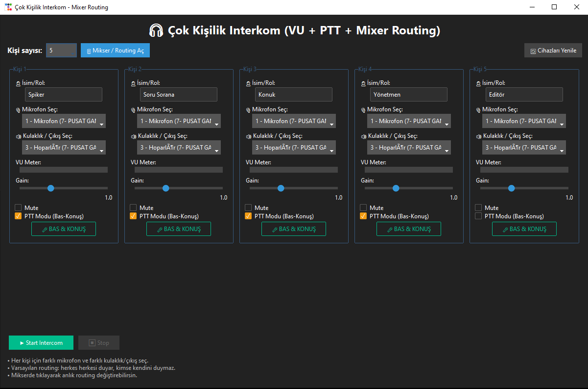
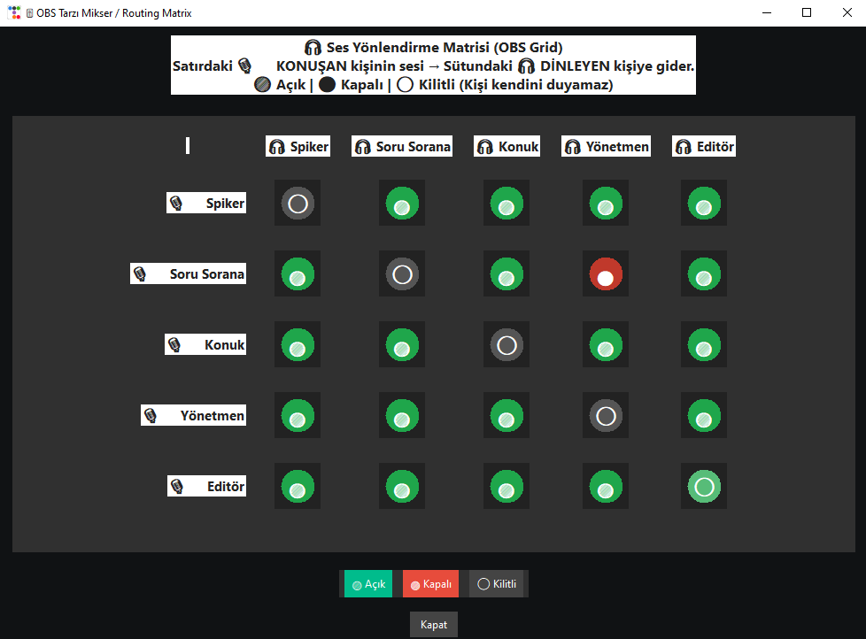

# 🎧 EBS Intercom – Çok Kişilik OBS Tarzı Ses Yönlendirme Sistemi



## 🎯 Projenin Amacı
Bu proje; yayın, podcast, radyo, zoom, oyun turnuvaları ve çoklu konuşma ortamları için tasarlanmış **gerçek zamanlı interkom / talkback sistemi** sunar.  
Birden fazla mikrofon ve kulaklık ile çalışan kişilerin **birbirlerini duyması** fakat **kendi seslerini duymaması** prensibiyle çalışır.

Ayrıca OBS tarzında gelişmiş **routing matrix** (kimin sesi kime gitsin), LED animasyonlu yuvarlak göstergeler, hover efektleri, fade geçişleri ve tıklama animasyonları içerir.

---

# 🚀 Özellikler

### ✔ Çok Kişilik Destek
- 3 kişi
- 4 kişi
- 5 kişi
- 6 kişi  
(İstenirse limitsiz kişi destekli genişletilebilir.)

### ✔ OBS Tarzı Routing Mikseri
- Yuvarlak LED node
- 🟢 Açık  
- 🔴 Kapalı  
- ⚪ Kilitli  
- Hover efekti  
- Fade geçişi  
- Tıklama animasyonu  
- OBS grid görünümü  

### ✔ Gerçek Zamanlı Ses Yönlendirme
- Ses gecikmesi düşük
- Gain ayarı
- Mute kontrolü
- PTT (Bas-Konuş) desteği
- Kişi kendi sesini **asla duyamaz** (echo feedback engellenir)

### ✔ GUI Özellikleri
- ttkbootstrap dark tema
- VU metre (konuşma seviyesi)
- Modern arayüz

---

# 💻 Hangi İşletim Sistemlerinde Çalışır?

| Platform | Durum |
|---------|--------|
| **Windows 10/11** | ✔ Sorunsuz |
| **Linux (Ubuntu / Debian / Mint)** | ✔ PyAudio kurulursa çalışır |
| **macOS (M1–M3 / Intel)** | ✔ Çalışır fakat bazı ses cihazı izinleri gerekir |

---

# 🧩 Gereksinimler

- Python 3.9 veya üzeri
- PyAudio
- numpy
- ttkbootstrap

Kurulum:

```
pip install pyaudio numpy ttkbootstrap
```

⚠ Windows için PyAudio bazen wheel ile yüklenir:  
https://www.lfd.uci.edu/~gohlke/pythonlibs/#pyaudio

---

# 🧠 Kimler Kullanabilir?

### 🎙 Yayıncılar (Streamers – Twitch – YouTube)
- Yayın esnasında yönetmen / konuk / sunucu arasında talkback sağlar.

### 📻 Radyo Sunucuları
- Ana yayın akışı + kulis iletişimi.

### 🎤 Podcast Sunucuları
- Herkes birbirini duyar, kendi sesini duymaz → echo yok.

### 🎬 Stüdyo ve Prodüksiyon Ekipleri
- Yönetmen → ekibe ses gönderip geri alabilir.

### 🎮 Oyun Turnuvaları / E-Spor
- Takım içi iletişim tertemiz yapılır.

---

# ➕ Artıları

### 👍 Profesyonel routing matrisi  
OBS grid görünümü, fade, hover, LED animasyonu ile **çok anlaşılır.**

### 👍 Echo engelleme  
Kişi kendi kendini duyamaz → feedback olmaz.

### 👍 Tamamen modüler  
Kişi sayısı arttırılabilir, routing genişletilebilir.

### 👍 Ücretsiz ve açık kaynak  
Her projede kullanılabilir.

---

# ➖ Eksileri

### 👎 Tek bilgisayarda çok ses cihazı yönetimi zor olabilir  
USB kulaklıklar + USB mikrofonlar → çok sayıda cihaz bağlandığında Windows karışabilir.

### 👎 PyAudio bazı sistemlerde kurulum ister  
Özellikle macOS ve Linux için portaudio kurulumu gerekir.

### 👎 Çok büyük kişi sayılarına çıkınca CPU kullanımı artabilir  
Her kişi için ayrı thread çalışır.

---

# 📥 Nasıl Kullanılır?

## 1️⃣ Programı çalıştır
```
python ebs_intercom_app.py
```

## 2️⃣ Kişi sayısı seç
- 3 / 4 / 5 / 6

## 3️⃣ Her kişi için:
- Mikrofon seç
- Kulaklık / çıkış seç
- Gain ayarla
- PTT veya sürekli açık seç
- VU metreyi takip et

## 4️⃣ “🎚 Mikser / Routing Aç” butonuna tıkla
Burada:

- 🟢 = ses gidiyor  
- 🔴 = ses gitmiyor  
- ⚪ = kilitli  
- Yuvarlak LED’e tıklayarak aç/kapa yapabilirsin.

## 5️⃣ START’a bas → interkom başlar

---

# 🏁 Sonuç
Bu proje, gerçek stüdyo ortamlarında kullanılabilecek kadar güçlü, yayıncı ve ekip iletişiminde profesyonel seviyeye yakın bir çözümdür.

Her şey tamamen açık kaynak olup istediğiniz gibi geliştirebilir veya genişletebilirsiniz.

---

# ✨ Geliştirici
**EBS – Ebubekir Bastama**

